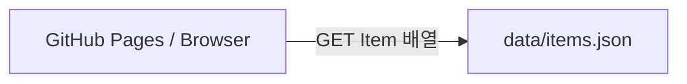

# 프로젝트 architecture

## 문제와 사용자

- 핵심 사용자: `[작성]`
- 해결할 문제: `[작성]`
- Must 한 문장: `[작성]`

## data contract

```text
listItems(): Promise<Item[]>
Item = { id: string, title: string, summary: string }
```

자신의 entity에 맞게 field와 의미를 바꾼다.

## 현재 흐름



## 다음 주 목표

`data-source.js` 내부의 static JSON 요청을 Supabase 공개 읽기 호출로 교체한다. Browser에는 publishable key만 두고, SQL에서 RLS와 최소 권한을 먼저 적용한다.

## 상태표

| 상태 | 발생 조건 | 사용자 문구 | 회복 행동 | 검증 |
|---|---|---|---|---|
| loading | `[작성]` | `[작성]` | `[작성]` | `[작성]` |
| empty | `[작성]` | `[작성]` | `[작성]` | `[작성]` |
| validation | `[작성]` | `[작성]` | `[작성]` | `[작성]` |
| unauthorized | `[작성]` | `[작성]` | `[작성]` | `[작성]` |
| not-found | `[작성]` | `[작성]` | `[작성]` | `[작성]` |
| network error | `[작성]` | `[작성]` | `[작성]` | `[작성]` |
