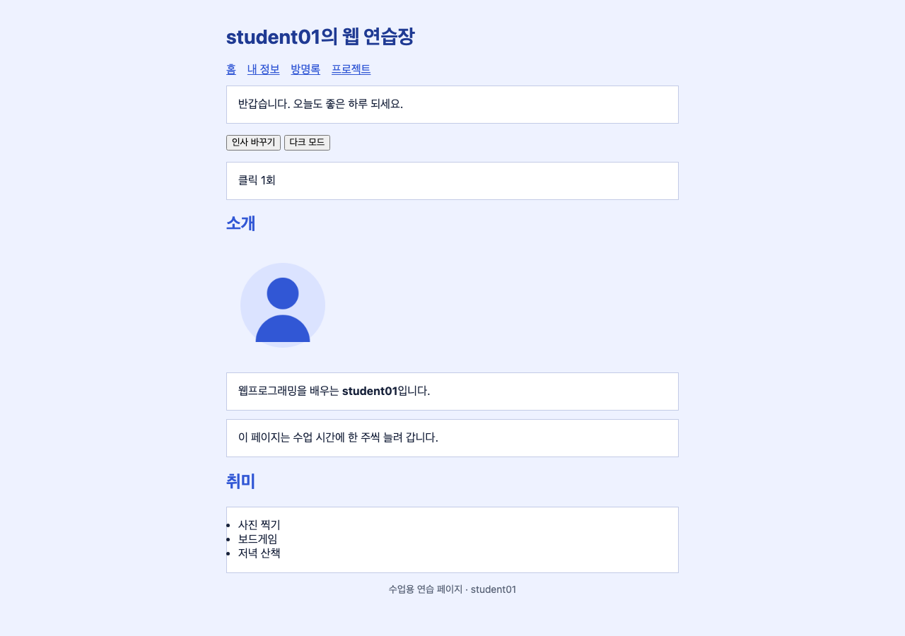
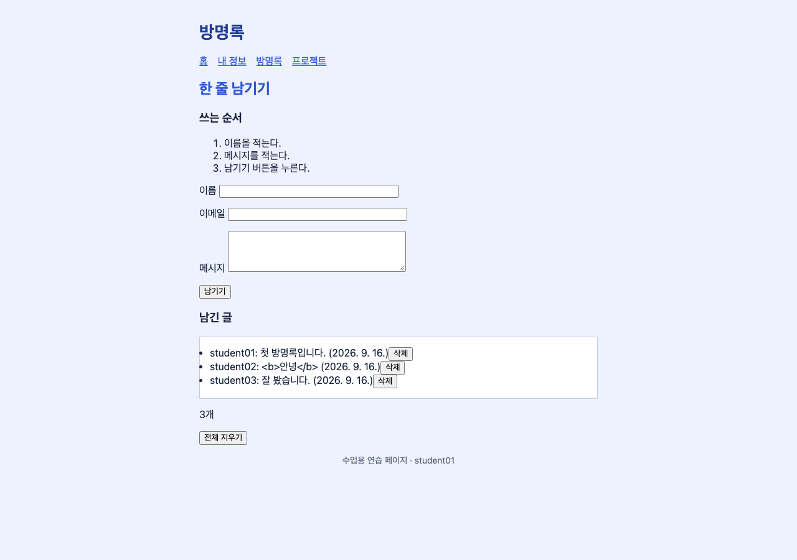
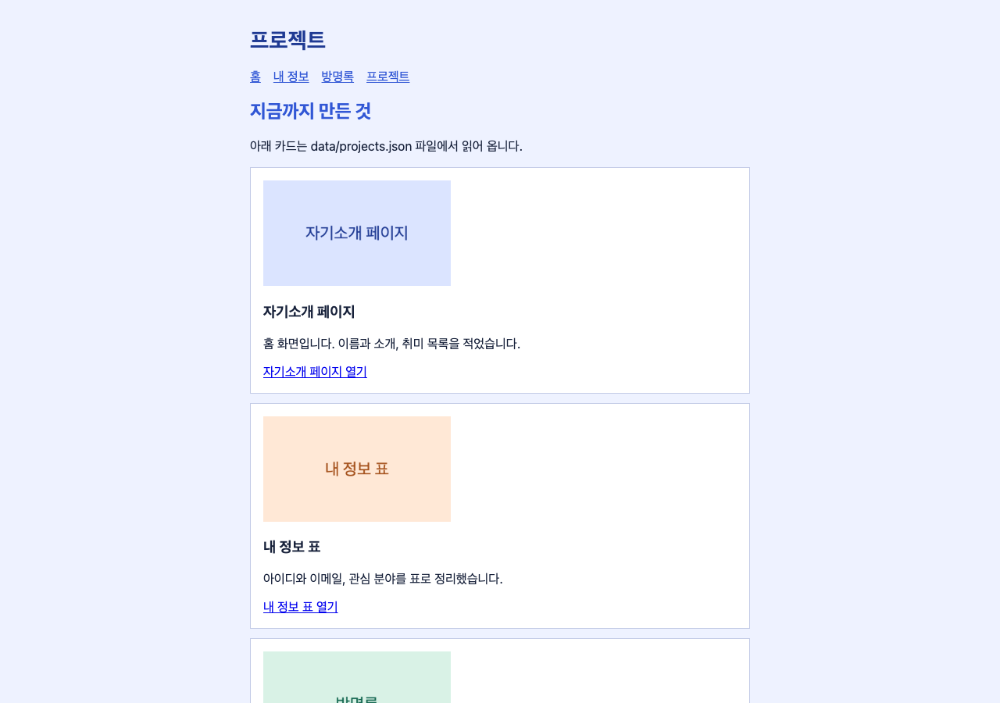

# my-web — student01의 웹 연습장

웹프로그래밍 수업에서 한 주씩 늘려 만든 자기소개 사이트입니다.

## 공개 주소

- [https://student01.github.io/my-web/](https://student01.github.io/my-web/)

## 페이지

- [홈 (index.html)](index.html) — 인사말, 소개, 취미 목록
- [내 정보 (about.html)](about.html) — 아이디·이메일·관심 분야 표, 입학 연도 계산
- [방명록 (guestbook.html)](guestbook.html) — 이름·메시지 폼과 남긴 글 목록
- [프로젝트 (projects.html)](projects.html) — JSON 파일에서 읽어 오는 카드 세 장

## 기능

- 홈의 "인사 바꾸기"와 "다크 모드" 버튼을 누르면 문장과 배경색이 바뀌고 클릭 횟수가 1씩 오릅니다.
- 내 정보에서 입학 연도를 적고 "계산하기"를 누르면 몇 년차인지 나옵니다. 숫자가 아니면 안내 문장이 나옵니다.
- 방명록에서 이름과 메시지를 적고 "남기기"를 누르면 목록에 한 줄이 쌓이고 "삭제"로 지울 수 있습니다.
- 방명록 목록은 브라우저에 저장되어 새로고침해도 남아 있습니다. "전체 지우기"로 비웁니다.
- 프로젝트 페이지는 data/projects.json 파일을 불러와 카드 세 장을 그립니다.

## 화면

## 사용 기술

- HTML: header·nav·main·footer, table, form, label
- CSS: 색·박스모델·flex·화면 폭 600px 아래 배치
- JavaScript: addEventListener, textContent, classList, 배열과 객체, localStorage, fetch
- GitHub Pages: main 브랜치 /(root)

## 어려움과 해결

- 새로고침하면 방명록이 사라졌습니다. localStorage에 저장하고 페이지를 열 때 다시 불러와 해결했습니다.
- 파일을 두 번 눌러 열면 프로젝트 카드가 나오지 않았습니다. push한 뒤 공개 주소에서 열어 해결했습니다.
- 방명록에 b 태그를 적어 보았습니다. textContent로 넣으므로 태그가 글자 그대로 보입니다.

## 만든 과정 (git log --oneline)

- 8f31c4a 방명록 글자 확인하고 alt·label 고치기
- 5c0b7e2 프로젝트 카드 안내 문장 넣기
- 2a94d16 projects.json 불러와 카드 그리기
- 7e12b05 방명록을 localStorage에 저장하기
- 4d6a893 방명록 목록 추가·삭제 만들기
